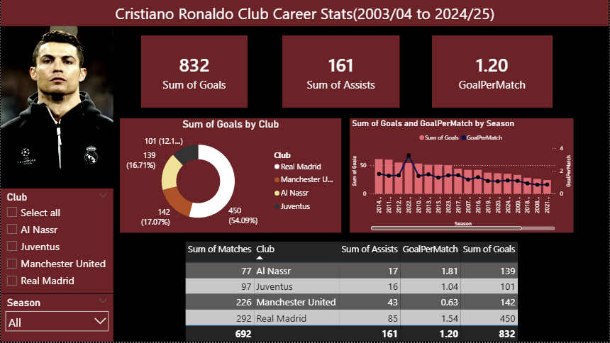

<<<<<<<< HEAD:readme.md
# Cristiano Ronaldo Club Career Stats Dashboard

## Project Overview
This project analyzes Cristiano Ronaldo's club career statistics from the 2003/04 season to the 2024/25 season using Power BI.

The dashboard provides interactive insights into:
- Goals scored
- Assists
- Goal-per-match trends
- Club-wise performance
- Seasonal analysis

---

## Tools Used
- Power BI
- Power Query
- SQL Server
- Excel

---

## Features
- Interactive slicers
- Dynamic charts
- KPI cards
- Club analysis
- Goal trend visualization

---

## Dashboard Preview

### Overview Dashboard
## Dashboard Preview

## Author
Tanvir Hasan
========

